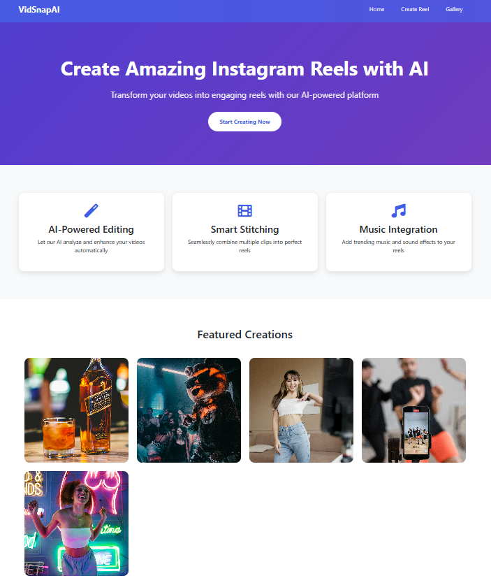
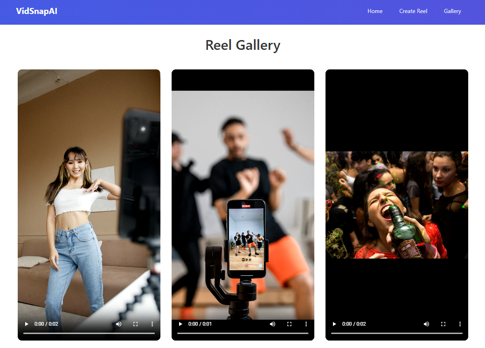

# VidSnapAi- AI Powered Reels Generator
I'm super excited to share VidSnapAi, my first Python-based project, where I built a smart reel-making automation tool. It transforms uploaded images and text into captivating video reels using Python, Flask, and FFmpeg — and it’s fully automated!

## Key Features:
🎤 Text to Speech – Converts text into AI voiceovers automatically

🖼 Image to Reel – Combines images into 1080x1920 vertical videos

🎞 FFmpeg Automation – Handles video scaling, padding, and export

🔄 Live Folder Monitoring – Detects and processes uploads in real-time

📁 One-Time Processing – Ensures each upload is converted only once

## How It Works:
Users upload images + enter text

Flask stores everything in a unique folder

Text is converted to audio via ElevenLabs

FFmpeg creates a reel by stitching images + voice

Output is saved and shown in the gallery

## Demo Video

https://github.com/user-attachments/assets/bf1741c8-8f4a-4167-a095-22ee754003b2

## Demo

* Main Page
  
  
  
* Create Reels Page (Add Photo & Audio)
 
  

* Gallery Page (Contains Created Reels)
  

## HAPPY SCROLLING REELS !!

  

  

  

